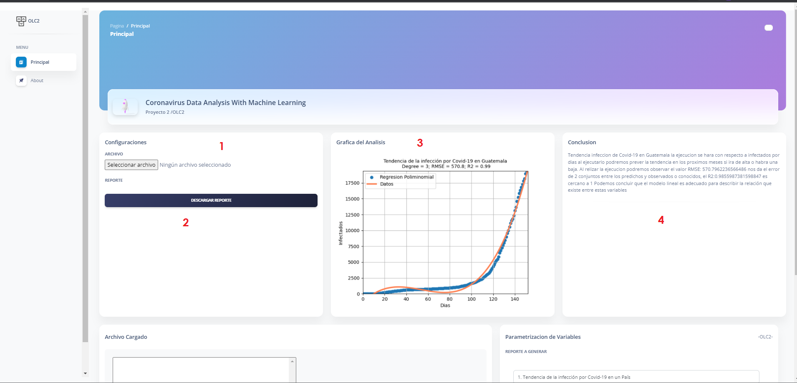
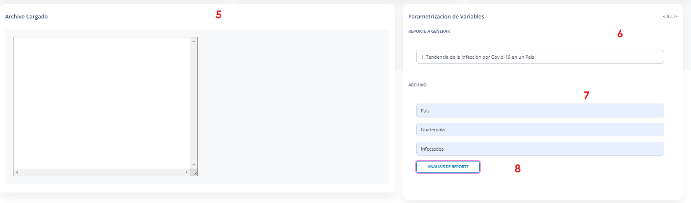
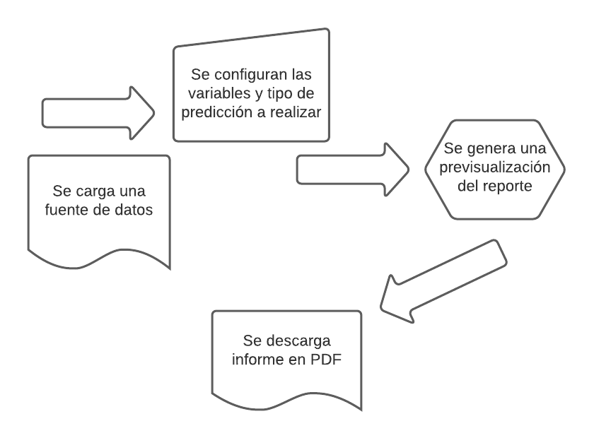
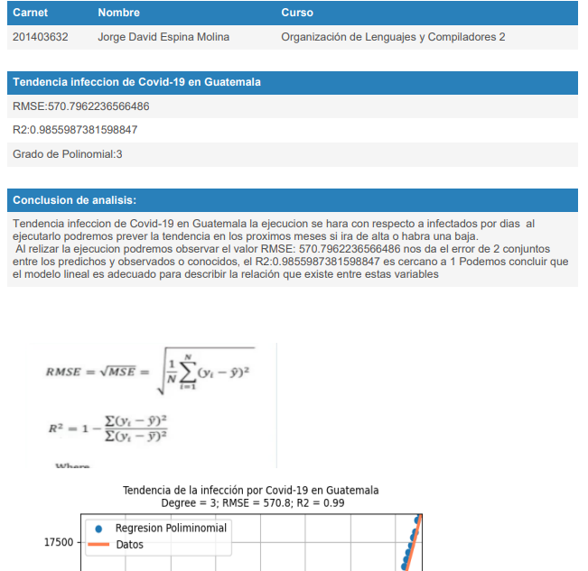

# Manual de Usuario

_Proyecto de Organización de lenguajes y Compiladores 2_

## Proyecto #2 - Coronavirus Data Analysis With Machine Learning🚀
## Integrante💁

| Nombre:                     | Carné     |
| --------------------------- | --------- |
| JORGE DAVID ESPINA MOLINA   | 201403632 |

_

### Herramientas Utilizadas 📋

- Angular 10.
- HTML: estructura del contenido web
- Java Script: es un lenguaje de programación interpretado, Se define como orientado a objetos, basado en prototipos, imperativo, débilmente tipado y dinámico.
- Type Script: es un lenguaje de programación libre y de código abierto desarrollado y mantenido por Microsoft.
- Windows 10 Home: Sistema operativo
- GitHub : Para el control de versiones. 
- Scikit-Learn: es una biblioteca de aprendizaje automático de software gratuito para el lenguaje de programación Python. 
- jsPDF: Generación de reportes. 
- matplotlib: es una biblioteca para la generación de gráficos a partir de datos contenidos en listas o arrays en el lenguaje de programación Python y su extensión matemática NumPy.
- Docker: automatiza el despliegue de aplicaciones dentro de contenedores de software
- Docker-Componse: es una herramienta para definir y ejecutar aplicaciones Docker de varios contenedores. Con Compose, usa un archivo YAML para configurar los servicios de su aplicación.
- ngnix: es un servidor web/proxy inverso ligero de alto rendimiento y un proxy para protocolos de correo electrónico.
- Python: Se trata de un lenguaje de programación multiparadigma, ya que soporta parcialmente la orientación a objetos, programación imperativa y, en menor medida, programación funcional.
- Flask: Es un framework minimalista escrito en Python que permite crear aplicaciones web rápidamente y con un mínimo número de líneas de código.
  

## Coronavirus Data Analysis With Machine Learning 🚀

### 📋 Detalle del Flujo de Quetzal

- 1 . Seleccionar un archivo este botón nos abrirá un navegador de windows en el cual podemos buscar el archivo de entrada que deseamos cargar.
- 2 . Descarga el Reporte elegido en formato pdf.
- 3 . Genera la Grafica despues de hacer el analisis.
- 4 . Conclusion del analisis realizado.
- 5 . Muestra el archivo cargado.
- 6 . Selecciona el campo y se desglosara los reportes que podra analizar.
- 7 . Se le habilitaran los campos necesarios al seleccionar el reporte.
- 8 . Despues de haber llenado todos los campos podra darle analizar para poder sacar los resultados.
### 📋 Reporte

